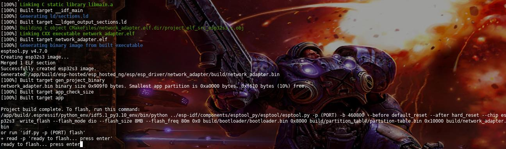
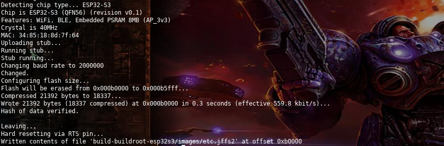
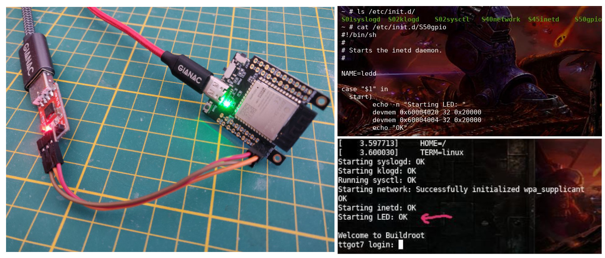

# ESP32 S3 Linux - Docker builder

The initial version was a Dockerfile ported by Adafruit from the work of [@jcmvbkbc](http://wiki.osll.ru/doku.php/etc:users:jcmvbkbc:linux-xtensa:esp32s3). The current version uses the last version of the build scripts like a git submodule and it has some improvements on the DockerFile to support USB flashing.

<table>
	<tr>
		<td>
			Don't forget to star ⭐ this repository
		</td>
	</tr>
</table>

## Build

Please follow the next steps:

1. Download or clone this repo

```bash
git clone --recursive https://github.com/hpsaturn/esp32s3-linux.git && cd esp32s3-linux
```

2. Then build the docker image:

```bash
docker build --build-arg DOCKER_USER=$USER --build-arg DOCKER_USERID=$UID -t esp32linuxbase .
```

3. Copy settings sample and configure it:

```bash
cp settings.cfg.default settings.cfg
```

Possible settings:

```bash
keep_toolchain=
keep_rootfs=
keep_buildroot=
keep_bootloader=
keep_etc=
``` 

put `y` to enable some one like this:

```bash
# keep_toolchain=y	-- don't rebuild the toolchain, but rebuild everything else
# keep_rootfs=y		-- don't reconfigure or rebuild rootfs from scratch. Would still apply overlay changes
# keep_buildroot=y	-- don't redownload the buildroot, only git pull any updates into it
# keep_bootloader=y	-- don't redownload the bootloader, only rebuild it
# keep_etc=y		-- don't overwrite the /etc partition
``` 

4. Run the build script of your preference, for example:

```bash
docker run --rm -it --name esp32s3linux --user="$(id -u):$(id -g)" -v ./esp32-linux-build:/app --env-file settings.cfg --device-cgroup-rule='c 166:* rmw' --device=/dev/ttyACM0 esp32linuxbase ./rebuild-esp32s3-linux-wifi.sh
```

Keep in mind that you should change the **--device** to your USB device where is connected the ESP32S3. For a different script please check the directory `esp32-linux-build`. This step takes around ~35 minutes and needs ~20Gb.

After that you should have this message:



## Flashing

1. Open a different terminal and enter to the running container:

```bash
docker exec -it -u root esp32s3linux bash
```

and change the docker USB device permissions:

```bash
chmod 666 /dev/ttyACM0 
```

2. Return to the main terminal and perform the flashing. And that's it!



---

## Updates

After the first build and flashing, you can keep the sources and working directories changing the `settings.cfg` file and repeating the steps from the step 4. Also don't forget update before, the git submodules like this:

```bash
git submodule update --init --recursive
```

For clean the working directories, please enter to `esp32-linux-build` and remove the build directory.

# Linux boot

For run it in a TTGO T7 S3 (LilyGO board), you should have a FTDI connection to the UART like is showed in the photo:

  

<video src="https://user-images.githubusercontent.com/423856/249861308-74ca4fc8-d0ab-4cc3-9166-cf66c65c70d8.mp4" controls="controls" style="max-width: 730px;">
</video>

For the complete details of features and current restrictions, please review the official [wiki](http://wiki.osll.ru/doku.php/etc:users:jcmvbkbc:linux-xtensa:esp32s3).

## WiFi settings

Only add your credentials on `/etc/wpa_supplicant.conf` using `vi` editor or from the command line, like this:

```bash
cat > /etc/wpa_supplicant.conf <<EOF
network={
        ssid="YOUR-SSID-HERE"
        psk="YOUR-SSID-PASSWORD-HERE"
}
EOF
```

then, reboot it and your able to connect to it via SSH.

## Misc

### Turning USB serial into the default console:

```bash
echo -n 'earlycon=esp32s3acm,mmio32,0x60038000 console=ttyACM1 debug rw root=mtd:rootfs no_hash_pointers' > /etc/cmdline
```

### Provisional GPIO handling:

```bash
devmem 0x60004020 32 2 # (output enable for gpio1)
devmem 0x60004004 32 2 # (drive gpio1 high)
```

For other GPIO be careful the syntax and the addressing, for instance for the LilyGO TTGO T7S3 board and its LED, the GPIO is the IO17, then you should be pass the number in hexadecimal, like this:

```bash
devmem 0x60004020 32 0x20000 # (ouput enable for GPIO 17)
devmem 0x60004004 32 0x20000 # (set GPIO 17 high)
```

Also you can enable the LED on the startup in a simple `inet.d` service:



Complete guide of GPIO implementation [here](http://wiki.osll.ru/doku.php/etc:users:jcmvbkbc:linux-xtensa:esp32s3:gpio)  
More info in the [technical document](https://www.espressif.com/sites/default/files/documentation/esp32-s3_technical_reference_manual_en.pdf) of the ESP32S3.

# TODO

- [x] Migrate to the last script version with build parameters
- [x] Freezing repositories to specific commit
- [x] Add provisioning stuff (etc partition)
- [ ] Improve the flashing step. Fix issue #10

# Credits

Main script and initial idea: [@jcmvbkbc](https://gist.github.com/jcmvbkbc/316e6da728021c8ff670a24e674a35e6)  
[Official Wiki](http://wiki.osll.ru/doku.php/etc:users:jcmvbkbc:linux-xtensa:esp32s3)  
English/Spanish [ESP32 Telegram group](https://t.me/esp_es)
