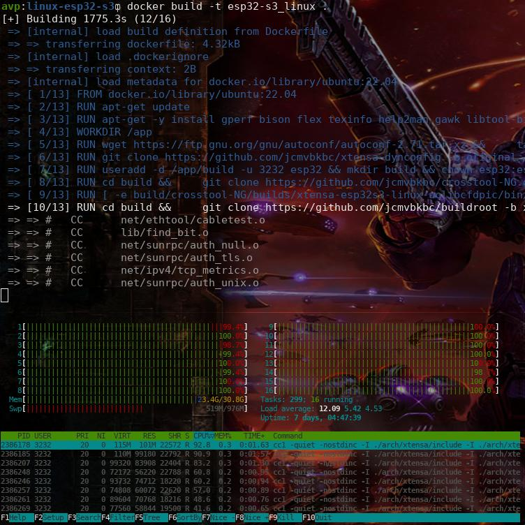

# ESP32 S3 Linux - Docker builder

Dockerfile ported by Adafruit from the work of [@jcmvbkbc](https://gist.github.com/jcmvbkbc/316e6da728021c8ff670a24e674a35e6)

## Build

Please follow the next steps:

1. Build the docker image:

```bash
docker build -t esp32-s3_linux .
```

This step takes around ~35 minutes and needs ~20Gb:



2. Run a container in a terminal

```bash
docker run --name esp32s3build -it esp32-s3_linux
```

3. In a second termintal, copy the binaries

```bash
docker cp esp32s3build:/app/build/release/ bin_files
```

4. Stop the container

```bash
docker stop esp32s3build 
```

# Upload

You must have two tools installed in your system, [ESPTool](https://docs.espressif.com/projects/esptool/en/latest/esp32/installation.html) and [Espressif IDF](https://docs.espressif.com/projects/esp-idf/en/latest/esp32/get-started/#installation). After that please upload the binaries using:

```bash
python esptool.py --chip esp32s3 -p YOUR-PORT-HERE -b 921600 --before=default_reset --after=hard_reset write_flash 0x0 bootloader.bin 0x10000 network_adapter.bin 0x8000 partition-table.bin
```

```bash
parttool.py write_partition --partition-name linux --input xipImage
```

```bash
parttool.py write_partition --partition-name rootfs --input rootfs.cramfs
```

And the etc partition:¨ (skip it if you preserver your settings)

```bash
parttool.py write_partition --partition-name etc --input build-buildroot-esp32s3/images/etc.jffs2
```

Alternative following this [Adafruit guide](https://learn.adafruit.com/docker-esp32-s3-linux/docker-esp32-s3-linux-image).

# Linux boot

For run in a TTGO T7 S3 (LilyGO board), you should have a FTDI connection to the UART like is showed in the photo:

  

<video src="https://user-images.githubusercontent.com/423856/249861308-74ca4fc8-d0ab-4cc3-9166-cf66c65c70d8.mp4" controls="controls" style="max-width: 730px;">
</video>

# WiFi settings

Only add your credentials on `/etc/wpa_supplicant.conf` using `vi` editor or from the command line, like this:

```bash
cat > /etc/wpa_supplicant.conf <<EOF
network={
        ssid="YOUR-SSID-HERE"
        psk="YOUR-SSID-PASSWORD-HERE"
}
EOF
```

then, reboot it and your able to connect to it via SSH.

# Misc

### Turning USB serial into the default console:

```bash
echo -n 'earlycon=esp32s3acm,mmio32,0x60038000 console=ttyACM1 debug rw root=mtd:rootfs no_hash_pointers' > /etc/cmdline
```

### Provisional GPIO handling:

```bash
devmem 0x60004020 32 2 # (output enable for gpio1)
devmem 0x60004004 32 2 # (drive gpio1 high)
```

For other GPIO be careful the syntax and the addressing, for instance for the LilyGO TTGO T7S3 board and its LED, the GPIO is the IO17, then you should be pass the number in hexadecimal, like this:

```bash
devmem 0x60004020 32 0x20000 # (ouput enable for GPIO 17)
devmem 0x60004004 32 0x20000 # (set GPIO 17 high)
```

Also you can enable the LED on the startup in a simple `inet.d` service:


More info in the [technical document](https://www.espressif.com/sites/default/files/documentation/esp32-s3_technical_reference_manual_en.pdf) of the ESP32S3.

# Development and Contributions

Maybe the best way to development is not using this guide, because is more easy modify the files and make code contributions from your local machine. For this reason you should have running the [official script](https://github.com/jcmvbkbc/esp32-linux-build) in your machine.

Also with this script you could have faster updates because it supports some skip parameters like this:

```bash
keep_toolchain=y keep_rootfs=y keep_buildroot=y keep_bootloader=y keep_etc=y ./rebuild-esp32s3-linux.sh
```

# TODO

- [ ] Migrate to the last script version with build parameters
- [ ] Freezing repositories to specific commit
- [ ] Add provisioning stuff

# Credits

Main script and initial idea: [@jcmvbkbc](https://gist.github.com/jcmvbkbc/316e6da728021c8ff670a24e674a35e6)
